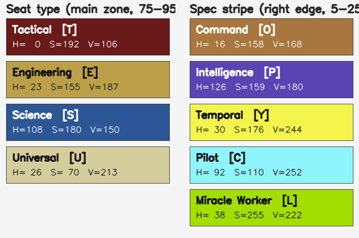

# STO SLOT RULES & WARP IMPLEMENTATION

## Space Equipment

### Weaponry

- **Fore Weapons** — 1 to 5 slots. Primary offensive slots. Supports all weapon types except Mines. Required slot for Dual Cannons and Dual Heavy Cannons.
- **Aft Weapons** — 0 to 5 slots (optional; some ship types have none). Support and tactical slots. Supports Beams, Turrets, Torpedoes, and Mine Launchers. Strategic for Omni-Directional Beams and Kinetic Cutting Beams.
- **Experimental Weapon** — 0 or 1 slot (optional). Exclusive to certain ship types (Escorts, Raiders, Destroyers, some Science Warships). Only Experimental Weapons can be placed here; standard weapons cannot.

> **WARP:** Experimental Weapon restriction is enforced explicitly in `warp_importer.py` via `_is_experimental()`. Items not of type `Experimental Weapon` are filtered out from this slot before the result is returned.
>
> **Gap:** Fore/aft weapon cross-validation is not enforced by WARP. A fore-only weapon (e.g., Dual Heavy Cannon) could be placed in an Aft slot if the icon matcher assigns it there. SETS handles this at the widget level, but WARP does not pre-filter it.

### Core Equipment (fixed 1 slot each)

- **Deflector Dish** — 1 slot. Mandatory.
- **Secondary Deflector** — 0 or 1 slot (optional). Exclusive to Science Vessels.
- **Impulse Engines** — 1 slot. Mandatory.
- **Warp Core / Singularity Core** — 1 slot. Mandatory. Singularity Core is used by Romulan ships.
- **Shields** — 1 slot. Mandatory.

### Devices and Consoles

- **Devices** — 1 to 6 slots. Maximum 6 (base 4; T6-X adds +1, T6-X2 adds another +1).
- **Universal Consoles** — 0 to 3 slots (optional). Available on T6-X / T6-X2 upgraded ships or specific Miracle Worker hulls. Each T6-X upgrade token adds +1 Universal Console slot.
- **Engineering Consoles** — 1 to 5 slots. Mandatory. Focus: hull, power, damage resistance.
- **Science Consoles** — 1 to 5 slots. Mandatory. Focus: shields, exotic damage, control.
- **Tactical Consoles** — 1 to 5 slots. Mandatory. Focus: weapon damage and critical hits.
- **Hangars** — 0 to 4 slots (optional). Exclusive to Carriers, Dreadnoughts, and Flight Deck ships.

### Console Placement Rules

| Item type | Allowed slots |
| :--- | :--- |
| Universal Console | Universal, Tactical, Engineering, Science |
| Tactical Console | Tactical, Universal |
| Engineering Console | Engineering, Universal |
| Science Console | Science, Universal |
| Hangar Pet | Hangars only |

> **WARP:** Console cross-compatibility is implemented at the cache level in `src/datafunctions.py`. Universal Consoles are copied into the Tac/Eng/Sci cache buckets, and each console type is also copied into the Universal bucket. `_make_equipment_item()` in `warp_dialog.py` enforces this implicitly — if an item is not present in the target slot's cache bucket, it is rejected and skipped. No separate validation function is required.

### Ship Tier and Slot Counts

- Slot counts are determined by ship class and tier (T1–T6).
- T6 and T5-U ships offer the maximum slot capacity for their class.
- Fleet variants typically add +1 console slot compared to the base version.
- T6-X upgrade: +1 Universal Console slot.
- T6-X2 upgrade (on top of X): +1 Device slot, +1 Starship Trait slot.
- Valid tier values: **T1, T2, T3, T4, T5, T5-U, T6, T6-X, T6-X2**.

> **WARP:** Exact slot counts per ship are sourced from `ship_list.json` (783 ships) via `ShipDB` in `warp_importer.py`. Lookup is by **ship type** (not name — name is cosmetic only). Lookup order: (1) exact type match → (2) word-subset match (handles OCR omitting subtype words, e.g. `"Fleet Temporal Science Vessel"` → `"Fleet Nautilus Temporal Science Vessel"`; when multiple candidates, ranked by boff seating similarity then fewest extra words) → (3) fuzzy match (cutoff 0.68) → (4) keyword-based fallback profile. Ship tier and type are extracted from the screenshot via OCR in `TextExtractor` using a wide top-band scan anchored on the Tier token.

---

## Space Traits

- **Personal Space Traits** — up to 10 slots.
- **Starship Traits** — up to 7 slots (5 base + 2 from Legendary or T6-X2 upgrades).
- **Space Reputation Traits** — up to 5 slots.
- **Active Space Reputation Traits** — up to 5 slots (optional).

---

## Ground Equipment

Slots appear in this order from top to bottom on the screenshot:

- **Kit Modules** — 1 to 6 slots (top of screen). Maximum 6. Career-specific (Engineering, Science, Tactical) unless labelled Universal.
- **Kit Frame** — 1 slot. Mandatory. Determines available Module slots.
- **Body Armor** — 0 or 1 slot (optional).
- **EV Suit** — 0 or 1 slot (optional).
- **Personal Shield** — 1 slot. Mandatory. Ground-only (cache: `personal_shield`). Distinct from space Ship Shields (cache: `shield`).
- **Weapons** — 1 to 2 slots (primary + secondary). Mandatory.
- **Ground Devices** — 0 to 3 slots (optional, bottom of screen).

> **WARP:** `GROUND_SLOT_ORDER` in `warp_importer.py` and `layout_detector.py` reflects this top-to-bottom order. Strategy 2 (pixel analysis) maps detected rows to slot names sequentially, so the order must match exactly.

---

## Ground Traits

- **Personal Ground Traits** — up to 10 slots.
- **Ground Reputation Traits** — up to 5 slots.
- **Active Ground Reputation Traits** — up to 5 slots (optional).

---

## Bridge Officers

Ability slots grouped by profession. Each seat holds abilities up to its rank (Ensign, Lieutenant, Lt. Commander, Commander).

Space professions: Tactical, Engineering, Science, Operations, Intelligence, Command, Pilot, Miracle Worker, Temporal. Operations and the specialist professions are optional (ship-type dependent).

### Seat marker colours

Each BOFF seat carries a coloured **marker badge** on the LEFT of its
name bar (the bar sits BELOW the 4 ability icons). The badge encodes the
seat profession; on specialist seats it splits into two zones:

- **Main zone** (75–95 % of bar width) — the base seat type
  (Tactical / Engineering / Science / Universal).
- **Spec stripe** (5–25 % of bar width on the RIGHT edge) — present only
  on specialist seats; encodes the specialization
  (Intelligence / Temporal / Miracle Worker / Pilot / Command).

A plain Tactical seat is one solid red bar. A Tactical-Intelligence seat
is mostly red with a thin purple stripe on the right.

#### Seat type (main zone) — OpenCV-HSV bands

| Seat type    | Hue (H, 0-180) | Saturation (S) | Value (V) | Code |
|--------------|----------------|----------------|-----------|------|
| Tactical     | 0–6 / 174–180  | ≥ 160          | ≥ 90      | T    |
| Engineering  | 18–30          | 120–200        | 160–210   | E    |
| Science      | 102–114        | ≥ 160          | ≥ 110     | S    |
| Universal    | 18–30          | 40–110         | ≥ 195     | U    |

Engineering and Universal share the gold hue (~23–26) but differ on
saturation: Engineering S ≈ 155, Universal S ≈ 70. Universal also reads
brighter (V ≈ 213 vs 187). Verified on `FaW_seating`,
`Screenshot_2025-09-08_194542`, `Screenshot_2025-09-25_104040`.

#### Spec stripe (right edge)

Verified against 15 user-labelled ground-truth seats across 9 screens
(2026-04-26):

| Stripe colour | H median | S median | V median | Specialization | Code |
|---------------|----------|----------|----------|----------------|------|
| Orange        | 16       | 158      | 168      | Command        | O    |
| Purple        | 126      | 159      | 180      | Intelligence   | P    |
| Bright gold   | 30       | 176      | 244      | Temporal       | Y    |
| Light cyan    | 92       | 110      | 252      | Pilot          | C    |
| Lime / yellow-green | 38 | 255      | 222      | Miracle Worker | L    |
| (none)        | —        | —        | —        | no specialization | — |

Pilot and Command are **distinct colours**, not the previously-assumed
shared orange. The Temporal stripe shares its hue band with Engineering's
main zone (~H 30) but is brighter (V ≈ 244 vs 187) and more saturated
than the seat-type colour, which keeps the two zones separable on
Engineering–Temporal seats.

The reference image above (`docs/images/boff_seat_marker_colors.png`) is
generated by `tests/diag_boff_marker_swatch.py` from the same HSV
centers used by the detector.

---

## Captain Specializations

- **Primary Specialization** — 1 slot. Mandatory.
- **Secondary Specialization** — 0 or 1 slot (optional).

Primary (30-point trees): Command Officer, Intelligence Officer, Miracle Worker, Pilot, Temporal Operative.
Secondary-only (15-point trees): Constable, Commando, Strategist.

---

## Screen Type Restrictions (WARP)

The **Screen Type** detected from a screenshot determines which slot types WARP will process. Each type maps to a fixed slot group in `SLOT_GROUPS` (`trainer_window.py`).

| Screen Type | Available slots |
| :--- | :--- |
| **SPACE_EQ** — Space Equipment | Space equipment + Ship Name / Ship Type / Ship Tier |
| **GROUND_EQ** — Ground Equipment | Ground equipment only (no ship metadata) |
| **TRAITS** | Space traits + Ground traits |
| **BOFFS** — Bridge Officers | Boff Tactical / Engineering / Science / Operations / Intelligence / Command / Pilot / Miracle Worker / Temporal |
| **SPECIALIZATIONS** | Primary Specialization, Secondary Specialization |
| **SPACE_MIXED** — Space Mixed (merged) | SPACE_EQ + TRAITS + BOFFS + SPECIALIZATIONS |
| **GROUND_MIXED** — Ground Mixed (merged) | GROUND_EQ + TRAITS + BOFFS + SPECIALIZATIONS |
| **UNKNOWN** | All slots (no restriction — let user decide) |

> **WARP:** Screen type classification uses a three-stage pipeline in `warp/recognition/screen_classifier.py`: (1) ONNX MobileNetV3-Small, (2) session k-NN on HSV histograms, (3) OCR keyword fallback. Recognised types: `SPACE_EQ`, `GROUND_EQ`, `TRAITS`, `BOFFS`, `SPECIALIZATIONS`, `SPACE_MIXED`, `GROUND_MIXED`. Slot filtering is applied immediately on type change via `_refresh_slot_combo()` in `trainer_window.py`.

### Same panels, different framing — detection invariant

The EQ panel rendered in `SPACE_EQ` is **the same in-game UI panel** as the EQ region of `SPACE_MIXED`. The only difference is that in MIXED the user has composed multiple game panels onto one screenshot in a layout of their choosing; in `SPACE_EQ` only that one panel is present (less surrounding noise).

**Implication for detection:** any structure-driven detector for SPACE_EQ must be the same code path the MIXED chain uses for its EQ region. Concretely both should run, in order: marker_boffs (irrelevant for pure EQ but cheap to skip if absent) → trait_grid (also irrelevant but cheap) → Strategy 1 learned → **Strategy 1.5 OCR-anchored** → full_scan (ML) → pixel-analysis fallback. Today (2026-05-08) `LayoutDetector.detect()` for `SPACE_EQ` skips Strategy 1.5 entirely and goes straight from Strategy 1 to pixel-analysis — that is an inconsistency, not a design choice. SPACE_EQ should be **easier**, not harder: same panel, fewer distractors. The same OCR labels (`Fore Weapons`, `Aft Weapons`, `Deflector`, `Engines`, `Shields`, `Devices`, `Universal Consoles`, `Engineering Consoles`, `Science Consoles`, `Tactical Consoles`, `Hangars`) are visible and anchor-worthy in both screen types.

**Hard rule:** never assume the EQ panel is anchored to a fixed image position (e.g. "right edge", "top-right"). Users compose screenshots arbitrarily — even in the supposedly "simple" SPACE_EQ case, the panel can sit anywhere. Detection must be panel-internal (OCR labels inside the panel, row pitch, single-slot-row signatures, icon frame style) — never image-edge-relative heuristics.

---

## Dropdown Filtering Logic (WARP)

When a user interacts with a specific slot during review, the item name search must be limited to items compatible with that slot type (rules from the Console Placement section above).

> **WARP:** Implemented implicitly via the SETS cache structure — each slot type is a separate dict in `cache.equipment`, cross-populated at startup. `_make_equipment_item()` in `warp_dialog.py` enforces this implicitly — if an item is not present in the target slot's cache bucket, it is rejected. Direct slot-scoped filtering in the WARP CORE annotation widget's item name autocomplete field is **not yet implemented** (pending feature).
